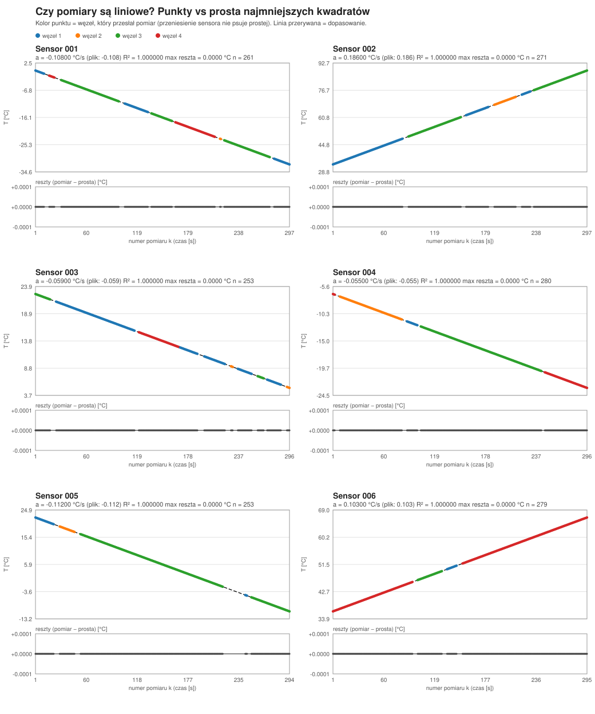
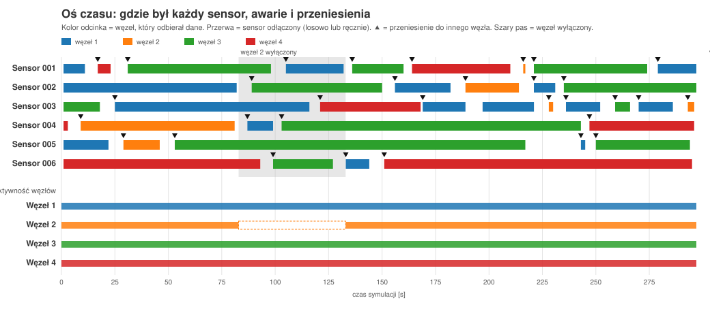
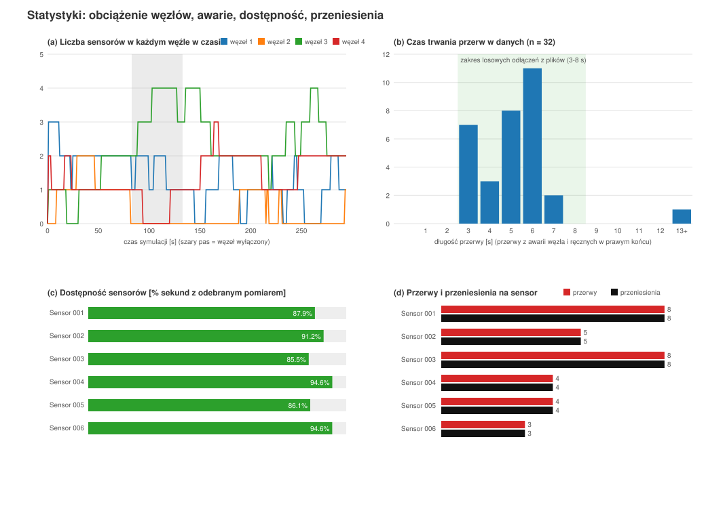

# Sieć sensoryczna – raport techniczny (9.10.2026)

Własna sieć sensoryczna: **sensory temperatury → węzły (max 4) → zlew (sink) z aplikacją**.
Implementacja w Pythonie 3, **wyłącznie biblioteka standardowa**. Elementy komunikują się
przez TCP (localhost); wiadomości to obiekty JSON zakończone znakiem nowej linii.

## 1. Zadanie i jego realizacja

| Wymaganie | Realizacja | Gdzie |
|---|---|---|
| Auto-przyłączenie sensora o unikalnym numerze do węzła | sensor pyta zlew o listę aktywnych węzłów (`get_nodes`), losuje węzeł i przedstawia się (`hello`) | `sensor.py` |
| Parametry sensora w pliku `SENSORxxx.TXT` (xxx = numer) | format `KLUCZ=WARTOŚĆ`, numer z nazwy pliku jest walidowany z `ID` | `sensors/`, `load_sensor_file` |
| Sensor temperatury, charakterystyka liniowa, odczyt co sekundę, start z wartości losowej, losowe przesunięcie na charakterystyce | `T(k) = T_START + A·(X0 + k·Δt)`, `T_START` i `X0` losowane z przedziałów z pliku | `LinearTemperatureModel` |
| Sensor w losowych chwilach może zostać odłączony (definicja w pliku) | `P_ODLACZENIA`, `CZAS_ODLACZENIA_MIN/MAX`, `PRZENOSZENIE` | `sensor.py`, `sensors/*.TXT` |
| Węzeł z unikalnym numerem, w każdej chwili przyjmuje sensor | serwer wielowątkowy, unikalność pilnuje zlew | `node.py` |
| Max 4 węzły, sensory przenoszone między węzłami | zlew odrzuca 5. i zdublowany węzeł; przeniesienie losowe i ręczne | `sink.py`, `sensor.py` |
| Zlew z aplikacją: węzeł, nr sensora, wynik | tabela odświeżana co sekundę + log zdarzeń + zapis do CSV | `sink.py` |
| Weryfikacja poprawności danych, rozkład awarii i zmian węzłów, wizualizacje | R², nachylenie, reszty, oś czasu, statystyki | `wizualizacje.py` |
| **Dodatkowo (życzenie):** węzły jako osobne pliki, z możliwością wyłączania | `nodes/NODExxx.TXT`, klucz `AKTYWNY` | `node.py`, `steruj.py` |

## 2. Architektura

```
 SENSOR 001 ─┐                          ┌───────────────────────────┐
 SENSOR 002 ─┼──► WĘZEŁ 1 (port 5001) ──┤                           │
 SENSOR 003 ─┘    WĘZEŁ 2 (port 5002) ──┤  ZLEW / SINK (port 5000)  │──► aplikacja (widok)
 SENSOR 004 ────► WĘZEŁ 3 (port 5003) ──┤  max 4 węzły              │──► dane/pomiary.csv
 SENSOR 005 ────► WĘZEŁ 4 (port 5004) ──┤                           │──► dane/zdarzenia.csv
      ▲                                 └─────────────┬─────────────┘
      └──────────── "get_nodes" (lista aktywnych węzłów) ─┘   ← auto-przyłączenie
```

### Pliki

| Plik | Rola |
|---|---|
| `common.py` | protokół: wysyłanie/odczyt wiadomości JSON, stałe (porty, `MAX_NODES = 4`) |
| `sensor.py` | sensor: plik `SENSORxxx.TXT`, model liniowy, auto-przyłączenie, losowe i ręczne odłączenia, przenoszenie |
| `node.py` | węzeł: rejestracja w zlewie, przyjmowanie sensorów, przekazywanie pomiarów, plik `NODExxx.TXT` (włączanie/wyłączanie) |
| `sink.py` | zlew + aplikacja wyświetlająca; zapisuje pomiary i zdarzenia do CSV |
| `generuj_sensory.py` | tworzy `sensors/SENSORxxx.TXT` (losowe parametry, stały seed) i `nodes/NODExxx.TXT` |
| `uruchom_siec.py` | demo na żywo: zlew + węzły + sensory w jednym oknie |
| `symulacja.py` | **powtarzalna symulacja do zebrania danych** (z losowymi awariami i scenariuszem ręcznych zdarzeń) |
| `steruj.py` | ręczne odłączanie / przenoszenie sensora i wyłączanie / włączanie węzła (zmienia plik TXT) |
| `wizualizacje.py`, `wykres_liniowosci.py` | weryfikacja danych i wykresy SVG |
| `test_siec.py` | 22 testy automatyczne (`unittest`) |
| `sensors/`, `nodes/` | pliki konfiguracyjne |
| `dane/` | dane z symulacji: `pomiary.csv`, `zdarzenia.csv`, `podsumowanie.txt`, `widok_zlewu.txt`, `wyniki_testow.txt` |
| `wizualizacje/` | wykresy SVG |

### Protokół (JSON, jedna linia = jedna wiadomość)

| Od → do | Wiadomość | Znaczenie |
|---|---|---|
| sensor → zlew | `get_nodes` | zapytanie o listę aktywnych węzłów (odp.: `nodes` z portami i liczbą sensorów) |
| sensor → węzeł | `hello` (nr sensora, typ, jednostka) | przyłączenie; węzeł odpowiada `welcome` |
| sensor → węzeł | `reading` (nr pomiaru `seq`, temperatura) | pomiar co sekundę |
| węzeł → zlew | `register_node` (nr, port) | rejestracja; odp. `ok` albo `error` (limit 4, duplikat) |
| węzeł → zlew | `sensor_attached` / `sensor_detached` | przyłączenie / odłączenie sensora (z tego zlew wykrywa **przeniesienia**) |
| węzeł → zlew | `data` (węzeł, sensor, seq, temp, ts) | pomiar z numerem węzła dopisanym przez węzeł |

## 3. Sensor

### Plik `SENSORxxx.TXT`

```
ID=001
TYP=TEMPERATURA
JEDNOSTKA=C
T_START_MIN=1           # losowa wartość startowa z przedziału [MIN, MAX]
T_START_MAX=6
NACHYLENIE_A=-0.108     # współczynnik kierunkowy prostej [°C/s]
PRZESUNIECIE_MIN=0      # losowe przesunięcie X0 na charakterystyce [s]
PRZESUNIECIE_MAX=19
SZUM=0.0                # opcjonalny szum gaussowski (0 = czysta prosta)
OKRES_PROBKOWANIA=1.0   # pomiar co 1 s
# --- sterowanie ręczne (plik jest czytany ponownie co sekundę) ---
POLACZONY=1             # 1 = przyłączony, 0 = odłącz sensor od węzła
WEZEL=0                 # 0 = dowolny węzeł, 1..4 = przyłącz / przenieś do tego węzła
# --- losowe odłączenia (awarie) ---
P_ODLACZENIA=0.02       # prawdopodobieństwo odłączenia w każdej sekundzie (0 = wyłączone)
CZAS_ODLACZENIA_MIN=3   # czas przerwy losowany z [MIN, MAX] sekund
CZAS_ODLACZENIA_MAX=8
PRZENOSZENIE=1          # 1 = po odłączeniu przyłącz do INNEGO węzła
```

### Model pomiaru

```
T(k) = T_START + A · (X0 + k · Δt)        (wzór prostej  y = a·x + b)
```

`T_START` – losowa wartość startowa, `X0` – losowe przesunięcie na charakterystyce od wartości
startowej, `A` – nachylenie, `k` – numer pomiaru, `Δt` = 1 s. **Numer pomiaru `k` rośnie także w
czasie odłączenia** – charakterystyka „biegnie dalej”, więc po powrocie wartości leżą na tej samej
prostej, a w danych zostaje przerwa w numeracji (z niej liczymy awarie).

### Auto-przyłączenie i odłączenia

1. Sensor pyta zlew o listę aktywnych węzłów, losuje węzeł (przy `PRZENOSZENIE=1` – inny niż poprzedni)
   i wysyła `hello`; węzeł odpowiada `welcome`. Gdy węzłów brak, sensor ponawia próbę.
2. **Losowe odłączenie:** w każdej sekundzie, z prawdopodobieństwem `P_ODLACZENIA`, sensor rozłącza się
   na czas z `[CZAS_ODLACZENIA_MIN, CZAS_ODLACZENIA_MAX]` s, po czym przyłącza się ponownie (zwykle do
   innego węzła = **przeniesienie**).
3. **Ręcznie:** sensor co sekundę czyta swój plik, więc wystarczy zmienić go w edytorze albo użyć `steruj.py`:

| zmiana w pliku | skutek |
|---|---|
| `POLACZONY=0` | sensor odłącza się i czeka (status ODŁĄCZ. w zlewie) |
| `POLACZONY=1` | sensor przyłącza się ponownie |
| `WEZEL=3` | sensor przechodzi do węzła 3 (przeniesienie), `WEZEL=0` = dowolny |

```bash
python steruj.py 2 odlacz        # sensor 002 -> POLACZONY=0
python steruj.py 2 przylacz      # sensor 002 -> POLACZONY=1
python steruj.py 5 przenies 4    # sensor 005 -> WEZEL=4
python steruj.py 5 auto          # sensor 005 -> WEZEL=0
```

## 4. Węzeł

- unikalny numer, port `5000 + nr`; przy starcie rejestruje się w zlewie – **zlew odrzuca 5. węzeł** i węzeł
  o powtórzonym numerze,
- przyjmuje sensory w dowolnej chwili (serwer wielowątkowy), do każdego pomiaru dopisuje swój numer,
- zgłasza `sensor_attached` / `sensor_detached`,
- **ma własny plik `nodes/NODExxx.TXT`** (czytany co sekundę), który pozwala go wyłączać:

```
ID=002
AKTYWNY=1     # 1 = węzeł działa, 0 = wyłączony (opuszcza sieć)
```

| zmiana w pliku | skutek |
|---|---|
| `AKTYWNY=0` | węzeł zrywa połączenia i wyrejestrowuje się ze zlewu (zwalnia miejsce z limitu 4); jego sensory same przechodzą do innego węzła |
| `AKTYWNY=1` | węzeł rejestruje się ponownie i znów przyjmuje sensory |

```bash
python steruj.py wezel 2 wylacz      # NODE002.TXT -> AKTYWNY=0
python steruj.py wezel 2 wlacz       # NODE002.TXT -> AKTYWNY=1
python node.py nodes/NODE002.TXT     # węzeł uruchomiony osobno z plikiem (python node.py 2 = bez pliku)
```

## 5. Zlew i aplikacja

Widok odświeżany co sekundę (`dane/widok_zlewu.txt` to przykład):

```
 Węzły w sieci: 4/4   [W1: 2 sens.]  [W2: 2 sens.]  [W3: 1 sens.]  [W4: 1 sens.]
  WĘZEŁ |  SENSOR |  TEMPERATURA | NR POM. |   CZAS   |  STATUS  | PRZEN.
   W4   |   001   |     -0.11 °C |    36   | 16:44:10 |  ONLINE  |   0
   ...
 Ostatnie zdarzenia: (przyłączenia, odłączenia, przeniesienia, wejścia/wyjścia węzłów)
```

Zlew zapisuje dwa pliki CSV:

| plik | kolumny |
|---|---|
| `pomiary.csv` | `czas, wezel, sensor, seq, temperatura, t_sym` – jeden wiersz = jeden pomiar odebrany przez zlew |
| `zdarzenia.csv` | `czas, t_sym, typ, wezel, sensor, opis` – typy: `wezel_dolaczyl`, `wezel_opuscil`, `wezel_odrzucony`, `sensor_przylaczony`, `sensor_odlaczony`, `sensor_przeniesiony` |

`t_sym` to czas symulacji w sekundach (niezależny od skrócenia sekundy przez `--tick`).

## 6. Uruchomienie

```bash
python generuj_sensory.py 6          # sensors/SENSOR001..006.TXT i nodes/NODE001..004.TXT (seed = powtarzalne)
python uruchom_siec.py               # podgląd na żywo w jednym oknie (Ctrl+C kończy)
python steruj.py 2 odlacz            # w DRUGIM oknie: ręczne sterowanie sensorami
python steruj.py wezel 2 wylacz      # ...i węzłami
python symulacja.py                  # zbieranie danych: 300 s symulacji w ok. 1 min -> dane/
python wizualizacje.py               # weryfikacja i wykresy -> wizualizacje/, dane/podsumowanie.txt
python -m unittest -v test_siec      # testy
```

Osobne procesy: `python sink.py`, `python node.py nodes/NODE001.TXT` (… 002–004), `python sensor.py sensors/SENSOR001.TXT`.

## 7. Symulacja, z której pochodzą dane (`symulacja.py`)

6 sensorów, 4 węzły, 300 s symulacji (sekunda skrócona do 0,2 s – ten sam kod, tylko szybciej).
Losowe awarie działają cały czas (`P_ODLACZENIA=0.02`, przerwy 3–8 s). Dodatkowo scenariusz ręcznych zdarzeń:

| t [s] | zdarzenie |
|---|---|
| 0 | próba dodania 5. węzła – zlew odrzuca (limit 4) |
| 80 | wyłączenie węzła 2 (`AKTYWNY=0`) |
| 130 | ponowne włączenie węzła 2 |
| 170 | sensor 3 przeniesiony ręcznie do węzła 1 (`WEZEL=1`) |
| 200 | sensor 3 znów w dowolnym węźle (`WEZEL=0`) |
| 220 | sensor 5 odłączony ręcznie (`POLACZONY=0`) |
| 245 | sensor 5 przyłączony ponownie |

Wynik: **1597 pomiarów** (z 1800 możliwych – reszta to przerwy), **89 zdarzeń**.
Pozostałe dane i wyniki testów: `dane/`.

## 8. Weryfikacja danych

### 8.1 Czy temperatura zachowuje charakterystykę liniową?

Dla każdego sensora dopasowano prostą metodą najmniejszych kwadratów do numeru pomiaru `seq`
(wykres: `wizualizacje/1_liniowosc.svg`) i porównano ją z plikiem konfiguracyjnym (`dane/podsumowanie.txt`):

| sensor | n | `a` dopasowane | `NACHYLENIE_A` w pliku | R² | max \|reszta\| | start w przedziale z pliku | przerwy | przenies. | dostępność |
|---|---|---|---|---|---|---|---|---|---|
| 001 | 261 | −0,10800 | −0,108 | 1,000000 | < 1e-5 | TAK | 8 | 8 | 87,9 % |
| 002 | 271 | 0,18600 | 0,186 | 1,000000 | < 1e-5 | TAK | 5 | 5 | 91,2 % |
| 003 | 253 | −0,05900 | −0,059 | 1,000000 | < 1e-5 | TAK | 8 | 8 | 85,5 % |
| 004 | 280 | −0,05500 | −0,055 | 1,000000 | < 1e-5 | TAK | 4 | 4 | 94,6 % |
| 005 | 253 | −0,11200 | −0,112 | 1,000000 | < 1e-5 | TAK | 4 | 4 | 86,1 % |
| 006 | 279 | 0,10300 | 0,103 | 1,000000 | < 1e-5 | TAK | 3 | 3 | 94,6 % |

**Wniosek:** dane leżą dokładnie na prostej o zadanym nachyleniu; wartość startowa mieści się w przedziale
wynikającym z `T_START_MIN/MAX` i `PRZESUNIECIE_MIN/MAX`; **przeniesienia między węzłami i przerwy nie
zaburzają prostej** (węzeł nie zmienia wartości, a numer pomiaru biegnie również podczas odłączenia).

*Uwaga o „idealnym” wyniku.* R² = 1 i reszty bliskie zeru wynikają z tego, że `SZUM=0`, a nachylenia mają
3 miejsca po przecinku – po zaokrągleniu pomiarów do 0,001 °C błąd zaokrąglenia jest stały i wszystkie punkty
nadal są współliniowe. Że sama metoda weryfikacji **wykrywa odchylenia**, sprawdzają testy
`test_szum_jest_wykrywany` (przy `SZUM=0.3` R² spada poniżej 0,9999, odchylenie reszt ≈ 0,3 °C, a nachylenie
nadal jest odtwarzane) i `test_czysta_prosta_ma_r2_rowne_1`. Szum włączamy w pliku sensora (`SZUM=…`).



### 8.2 Jak rozkładają się awarie i zmiany węzłów

Oś czasu (`wizualizacje/2_os_czasu.svg`): wiersz = sensor, kolor odcinka = węzeł odbierający dane,
przerwa = sensor odłączony, trójkąt = przeniesienie, szary pas = węzeł wyłączony.



Statystyki (`wizualizacje/3_statystyki.svg`): (a) liczba sensorów w każdym węźle w czasie,
(b) histogram długości przerw, (c) dostępność sensorów, (d) przerwy i przeniesienia na sensor.



**Obserwacje:**

- **Losowe awarie zgodne z definicją w pliku.** 31 z 32 przerw w danych ma długość 3–7 s (średnio ok. 4,9 s),
  czyli mieści się w `CZAS_ODLACZENIA_MIN/MAX` = 3–8 s (histogram b). Jedyna dłuższa przerwa (25 s) to ręczne
  odłączenie sensora 5 w t = 220 s ze scenariusza. Oczekiwana liczba losowych awarii to ok. 300 s × 0,02 ≈ 6 na
  sensor; zaobserwowano 3–8 (suma 32), co zgadza się z oczekiwaniem.
- **Dostępność sensorów 85,5–94,6 %** (c); najwięcej przerw miały sensory 001 i 003 (po 8).
- **Przeniesienia.** Przy `PRZENOSZENIE=1` każde losowe odłączenie kończy się powrotem do innego węzła, dlatego
  liczba przeniesień jest równa liczbie przerw (d); sensory „krążą” po sieci, a obciążenie węzłów (a) zmienia
  się skokowo.
- **Awaria węzła (t = 80–130 s).** Wyłączenie węzła 2 (zlew: t ≈ 83 s) zrywa połączenie sensora 004, który
  był jedynym sensorem tego węzła; po ok. 6 s sensor sam przyłącza się do węzła 1. W panelu (a) węzeł 2 nie ma
  w tym czasie żadnego sensora, a jego sensory przejmują pozostałe węzły. Po włączeniu (t ≈ 133 s) węzeł
  wraca do sieci, ale sensory nie wracają same – zostają tam, gdzie trafiły, dopóki nie zostaną przeniesione
  lub nie wystąpi kolejne odłączenie.
- **Przeniesienie ręczne (t = 170–200 s).** Sensor 3 w t ≈ 172 s przeszedł do węzła 1 (`WEZEL=1`) i był w nim
  do t ≈ 189 s. Po krótkiej losowej awarii (t ≈ 190–196 s) wrócił znów do węzła 1 – bo `WEZEL=1` wymusza ten
  węzeł, więc „losowe” przeniesienie nie jest możliwe – i został w nim do kolejnego odłączenia (t ≈ 221 s),
  już po ustawieniu `WEZEL=0` w t = 200 s. Na osi czasu jest to niebieski wiersz sensora 003.
- **Limit 4 węzłów.** Próba dodania węzła 5 została odrzucona (`wezel_odrzucony` w `zdarzenia.csv`).

## 9. Testy

```bash
python -m unittest -v test_siec        # wynik: dane/wyniki_testow.txt  ->  22/22 OK
```

W testach „sekunda” jest skrócona do 0,05 s, każdy test ma własną pulę portów.

| Test | Co sprawdza |
|---|---|
| `test_wczytanie_parametrow`, `test_zla_nazwa_pliku`, `test_niezgodny_numer` | odczyt `SENSORxxx.TXT`, walidacja numeru |
| `test_start_losowy_w_przedziale`, `test_kolejne_wartosci_na_prostej` | losowy start i przesunięcie w przedziałach; pierwsza wartość = `T_START + A·X0`, stały przyrost = `A` |
| `test_czysta_prosta_ma_r2_rowne_1`, `test_szum_jest_wykrywany` | weryfikacja liniowości: prosta → R² = 1, szum → wykryty |
| `test_max_4_wezly`, `test_duplikat_numeru_wezla` | limit 4 węzłów, unikalność numeru |
| `test_auto_przylaczenie_i_dane_w_zlewie`, `test_przylaczenie_gdy_wezel_pojawi_sie_pozniej` | auto-przyłączenie; węzeł przyjmuje sensor w dowolnej chwili |
| `test_reczne_odlaczenie_i_przylaczenie`, `test_reczne_przeniesienie_do_wezla`, `test_steruj_cli` | `POLACZONY` / `WEZEL` w pliku i `steruj.py` |
| `test_odlaczanie_i_przenoszenie_miedzy_wezlami` | losowe odłączenia, przeniesienie zawsze do innego węzła |
| `test_wiele_sensorow_na_wielu_wezlach` | 8 sensorów rozłożonych na 4 węzłach |
| `test_awaria_wezla_sensor_przechodzi_dalej` | po zatrzymaniu węzła sensor przechodzi do innego |
| `test_plik_wezla`, `test_wylaczenie_i_wlaczenie_wezla`, `test_wezel_wylaczony_od_startu` | plik `NODExxx.TXT`: `AKTYWNY=0/1` wyłącza i włącza węzeł |
| `test_wylaczony_wezel_zwalnia_miejsce_w_sieci` | wyłączony węzeł nie liczy się do limitu 4 |
| `test_sensor_przechodzi_gdy_wezel_wylaczony` | sensor przechodzi do innego węzła po wyłączeniu swojego |

## 10. Ograniczenia i uwagi

- Wszystko działa na jednym komputerze (`127.0.0.1`); porty `5000–5004`.
- Dane są **bez szumu** (`SZUM=0`) – to model idealny; szum jest opcją w pliku (patrz 8.1).
- Wykresy rysują oś czasu po numerze pomiaru sensora, a pasy wyłączonych węzłów po czasie zlewu; przy skróconej
  sekundzie (0,2 s) różnica to ok. 1–2 % (kilka sekund na 300), co nie wpływa na wnioski.
- Skrócenie sekundy (`--tick`) nie skaluje opóźnień sieci i systemu (np. ponowne połączenie po wyłączeniu węzła
  trwa ułamek rzeczywistej sekundy, czyli kilka „sekund symulacji”); przy `--tick 1.0` są one pomijalne.
- Po awarii węzła sensory nie wracają samoczynnie do poprzedniego węzła (świadoma decyzja – brak „preferowanego” węzła).
- `zrzuty/*.png` to starsze zrzuty ekranu z wcześniejszego uruchomienia, niezwiązane z tym raportem; aktualne
  wykresy są w `wizualizacje/`.
